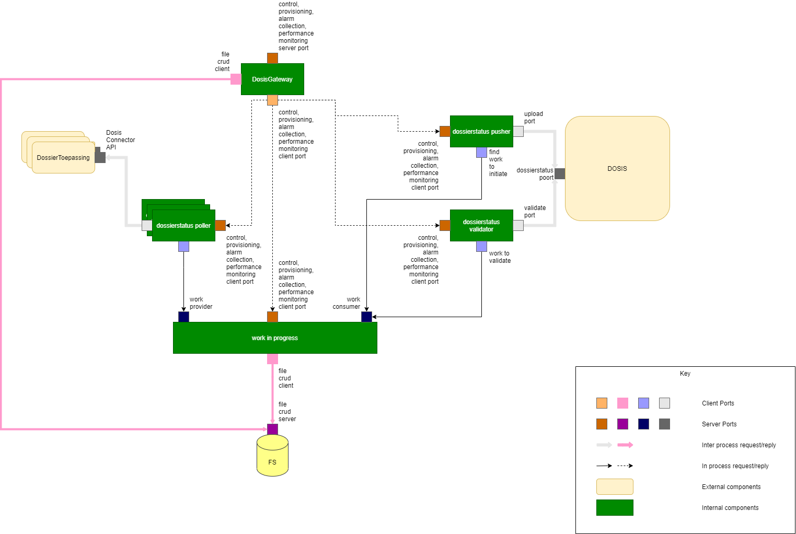

# Dosis-Connector


## Wat is dosis-connector?

De dosis-connector is een vrijstaande applicatie die op gegevens afhaalt van een of 
meerdere dossierbeheersystemen, en vervolgens deze gegevens doorstuurt naar DOSIS. 
De frequentie waarmee gegevens worden afgehaald is instelbaar, alsook de verschillende
systemen waar dit moet gebeuren. Het project veronderstelt wel dat alle 
geconfigureerde systemen waarvan gegevens worden afgehaald behoren tot dezelfde
bron (d.w.z. ze hebben globaal een unieke id voor hun dossiers).

## Opbouw van de repository

* documentation: deze folder bevat de figuren van de documentatie
* dosis-connector: deze folder bevat de broncode van het dosis-connector project
* dbssim: deze folder bevat een simulator voor het dossierbeheersysteem welke kan
gebruikt worden om de dosis-connector mee te testen.

## Snel van start

### Dosis-Connector bouwen

```
cd dosis-connector
mvn clean install
```

Een ```mvn clean install``` is enkel nodig indien men de dossierbeheersysteem simulator 
nodig heeft. Indien niet volstaat een ```mvn clean package```.

Men kan de connector opstarten als volgt:
```
java -jar .\controller\target\dosis-connector-controller-0.0.1-SNAPSHOT.jar
```
Dit zal de connector opstarten op basis van de interne properties file. Commandline
kan een externe property file worden meegegeven:

### Dossierbeheersysteem simulator bouwen en uitvoeren
Om de simulator voor het dossierbeheersysteem te bouwen doet men vervolgens: 
```
cd dbssim
mvn clean package
```
Dit genereert een jar bestand onder target: *dbssim-0.0.1-SNAPSHOT.jar* dat kan worden
uitgevoerd met ```java -jar dbssim-0.0.1-SNAPSHOT.jar``` Dit start vervolgens de 
simulator op welke standaard op poort 8080 draait.

Er is tevens een dockerfile meegeleverd waarmee de simulator makkelijk in een docker
container worden opgestart:

```
cd dbssim
docker build -t vlaio/dbssim .
docker run -p 29090:8080 vlaio/dbssim
```

In dit geval zal de simulator draaien op poort 29090. De simulator simuleert twee services:
* /dossierstatusveranderingen: deze geeft een correcte respons terug
* /fout/dossierstatusveranderingen: deze simuleert steeds een internal server error

De dossiersimulator is beperkt configureerbaar via een spring properties file. Volgende yml file is aanwezig in de codebase (onder /src/main/resources/application/yml):

```
generate:
  delay: 1000
  itemsPerCycle: 3
  errorPercentage: 20
  maxItems: 100
  hardcoded:
    product: 1984
```

De simulator genereert ```itemsPerCycle``` nieuwe items, elke ```delay``` seconden, tot er in totaal ```maxItems``` zijn gegenereerd. Standaard zijn de gegenereerde items correct voor dosis. Indien je wil dat de simulator ook foutieve items genereert (deze hebben een incorrect rijksregisternummer), dan kan je dit kiezen via je ```errorPercentage``` dat aangeeft welk percentage van de gegenereerde items foutief moet zijn. De simulator laat ook toe om een vast product te kiezen ipv een random waarde, in welk geval je de waarde ook kan configureren.


## Opbouw van de dosis-connector

Conceptueel wordt de dosis-connector voorgesteld door volgend schema:



## Componenten
### De Poller

De poller(s) worden in de configuratiefile geconfigureerd onder de ```poller``` sectie die er uitziet als volgt:
```
  poller:
    delay: 150
    instances:
      -   name: dev
          url: http://localhost:29090/
          itemlimit: 100
          backoffBase: 10
          backoffExponent: 3
          backoffMaxRetries: 10
      -   name: fout
          url: http://localhost:29090/fout
          itemlimit: 100
          backoffBase: 10
          backoffExponent: 3
          backoffMaxRetries: 3
```
#### Poll-gedrag
De poller haalt de items op bij het dossierbeheersysteem in batches die maximaal ```itemlimit``` groot zijn (geconfigureerd per poller). Zolang het dossierbeheersysteem nieuwe elementen teruggeeft, blijft de actie van de poller lopen en zal deze onmiddellijk opnieuw bijkomende elementen opvragen. Dit om achterstand snel weg te werken. Een poller begint steeds bij index 0, en de nieuwe index wordt berekend op basis van het index veld van het laatst verwerkte element. M.a.w. als het dossierbeheersysteem na een oproep van de poller (index 0, limit 10) twee elementen teruggeeft met indexen 3405 en 3409, zal de poller zijn volgende oproep beginnen bij 3410. **Het is dus heel belangrijk dat het dossierbeheersysteem elementen in volgorde van index teruggeeft!**

Vanaf de poller in een oproep geen nieuwe elementen binnenkrijgt, wacht hij een bepaalde tijd alvorens opnieuw te proberen. Deze tijd wordt bepaald in de globale parameter ```delay```. De ```delay``` parameter is globaal gedeeld door de pollers. De tijd begint te tellen nadat de poller zijn vorige taak heeft afgerond.

#### Exponential backoff

Indien er een fout optreedt bij de communicatie naar het dossierbeheersysteem, implementeert Poller een exponential backoff principe, waarbij de poller steeds langer wacht om opnieuw te proberen tot deze uiteindelijk zichzelf permanent deactiveert. Dit gedrag wordt geconfigureerd door 3 parameters: ```backoffBase```, ```backoffExponent``` en ```backoffMaxRetries```. 

Poller slaat bij een fout de volgende *n* polls over, waarbij *n* gelijk is aan: 

```
                      backoffExponent
backoffBase  *  errors               
```

In bovenstaande formule is ```errors``` het aantal opeenvolgende fouten dat de poller bij de service is tegengekomen. Vanaf dit aantal ```backoffMaxRetries``` overschrijdt zal de poller niet meer pollen naar de service tot deze wordt gereactiveerd. 

#### Voorbeeld

Als de poller geconfigureerd is als volgt:

```
  poller:
    delay: 5000
    instances:
      -   name: voorbeeld
          url: http://localhost:29090/
          itemlimit: 100
          backoffBase: 10
          backoffExponent: 3
          backoffMaxRetries: 10
```

Bij terugkerende fouten aan het dossierbeheersysteem zal de poller als volgt opnieuw proberen:

* 1e retry na 50 seconden (10 polls overgeslagen aan 5 sec/poll)
* 2e retry na 6 minuten   (80 polls overgeslagen aan 5 sec/poll)
* 3e retry na 22 minuten  (270 polls overgeslagen aan 5 sec/poll)
* 4e retry na 53 minuten
* 5e retry na 1u 44 minuten
* 6e retry na 3u
* 7e retry na 4u 20 min
* 8e retry na 7u 6 min
* 9e retry na 10u
* 10e retry na 13u 30 min

Als die 10e retry dan ook gefaald is deactiveert de poller zich permanent


### De Controller

### De Pusher & De Validator

Zowel de pusher als de validator worden geconfigureerd in de configuratiefile onder de ```dosis``` sectie die er uitziet als volgt:
```
  dosis:
    clientid: 1234
    tokenUrl: https://beta.oauth.vlaanderen.be/authorization/ws/oauth/v2/token
    baseUrl: https://beta.dosis.dev-vlaanderen.be
    bronUri: urn://somebron/
    privateWebKey: someFileName.key
```

Deze configuratieparameters bepalen het gedrag in de interactie met het DOSIS platform. 

* De ```clientid``` heb je normaal ontvangen bij de aansluiting met DOSIS en is een unieke id van je oauth client.
* De ```tokenUrl``` en ```baseUrl``` parameters bepalen welke URLS er worden gebruikt bij de communicatie naar DOSIS. In het bovenstaande voorbeeld zijn de waarden gekozen voor de beta/test omgeving. Voor productie zijn de waarden respectievelijk https://oauth.vlaanderen.be/authorization/ws/oauth/v2/token en https://prod.dosis-burgers.vlaanderen.be
* De ```bronUri``` geeft aan onder welke bron alle dosis items die je zal publiceren zullen vallen bij DOSIS. De dosisconnector laat niet toe om meerdere bronUri's te specificeren. Indien je die nood hebt, zal je meerdere instanties van de dosisConnector moeten gebruiken.
* ```privateWebKey``` is een verwijzing naar het bestand waar het private gedeelte van je Json Web Key kan gevonden worden. De Json webkey wordt gegenereerd als een paar waarvan het publieke gedeelte moet worden geupload in de admin site van DOSIS, en het private gedeelte ter beschikking moet staan van de dosis connector om de oproepen naar dosis te kunnen uitvoeren. Een gedetailleerde uitleg van ho je een Json Web Key kan genereren, alsook hoe je deze kan opladen kan je vinden op [deze url](https://vlaamseoverheid.atlassian.net/wiki/spaces/IKPubliek/pages/2680390681/Beveiliging+van+de+DOSIS-API#Hoe-een-JSON-Web-Token-lokaal-genereren). 

### De Validator
### WorkInProgress & DiskStore
## Onderlinge afhankelijkheden
